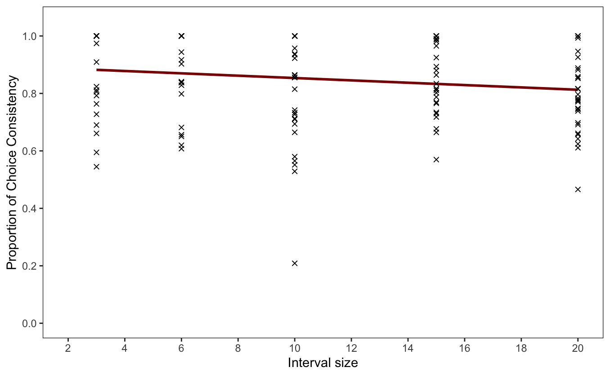
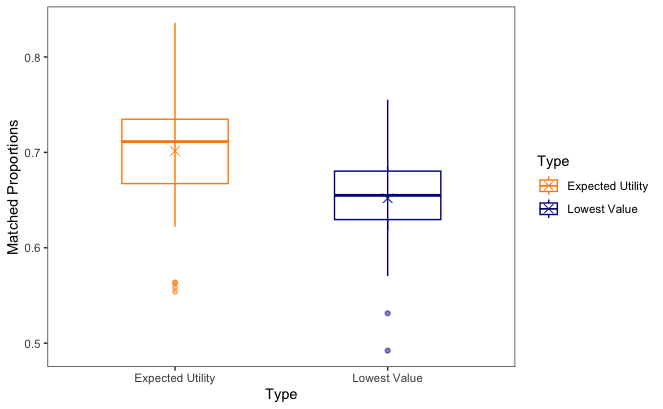

# General Guidelines

There are two tasks. Your answers should have *two separate sections for each task*, one immediately after the other.

In the first section, write out your answers using complete sentences, as you would for the results section of a paper. Include descriptive statistics in the text, tables or figures, as appropriate. Tables and figures should be of publication quality (i.e., fully labelled, etc.). Integrate inferential statistics into your description of the results. Your answers might be quite short. **Given the validity of the statistical analysis, the first section will play the main role for your mark.**

The second section should include the complete `R` code that you used and its output. Add comments (using a `#`) to explain what the code does. The code should show all of the commands that you used; enough to replicate exactly what you did (I will be copying and pasting code to run checks, so make sure that works). You can include additional figures in the second section that you used to explore the data, which you do not wish to include in the first section. I will use the second section to help identify the source of any mistakes. For practical reports and papers you would only submit the first section; thus the first section should stand alone without requiring the reader to refer to the second section.

## Libraries

```{r library, message=FALSE}
library(tidyverse)
library(afex)
library(emmeans)
library(BayesFactor)
library(bayestestR)
library(insight)
library(rstanarm)
```

> ***TASK 2 STARTS ON PAGE 33***

\newpage

# Task 1

Decision making is fundamentally noisy, and experimental participants will often make different choices between the same two risky alternative even during the same experimental session. An interesting question is why choices are inconsistent: is it because participants' decisions are just inherently noisy? Or perhaps is it because participants' deterministic preferences are dynamically changing throughout the experiment, and so they only appear to be stochastic?

To test whether participants' preferences are dynamically changing it is possible to manipulate the amount of time (i.e., number of intervening trials) between repeated choices. If participants' preferences are dynamically changing, we would expect that for shorter intervals between repeated choices that participants would make more consistent decisions compared to the consistency for longer intervals.

The file `consistency.csv` contains simulated data about choice consistency, where participants were split at random to repeat choices at different intervals (variable `Interval`), where the interval is the number of intervening trials. Participants (variable `id`) completed a long series of choices between two alternatives with the repetitions of various alternative pairs hidden within this series. The variable `Consistency` gives the proportion of repeated choices for which a participant made the same choice across the two repetitions.

Please analyse the data using both frequentist and Bayesian linear regression models. The main research question is whether choice consistency decreases with longer intervals. For this task only, please implement your Bayesian linear regression using a variety of R-based implementations and priors, including AIC and BIC, and compare your results for robustness across these implementations and priors.

Present the results as you would in a paper, using APA format. In other words, describe your statistical model and results and describe the conclusions with regards to the research questions. In the first section of your answer for this task, include only one figure (which may contain multiple panels), with an appropriate figure caption.

\newpage

## Part 1: Results Description

An experiment was conducted to investigate whether a person's decision would change when presented with two alternatives, with a varying interval size (i.e., number of intervening trials) between them. The core research question is to explore whether choice consistency (i.e., participant choosing the same option) decreases as interval size increases.

The relationship between interval size and the proportion of choice consistency (*M* = .849, *SD =* .154) across both alternatives was analysed using both frequentist and Bayesian linear regression models. Interval size was not a significant predictor of choice consistency with the Bayes factor suggesting there is no evidence for this alternate model ($\beta = -.00408, \ p = .0529, BF_{10} = 1.020$; Figure 1). Hence, the overall linear model was not significant ($F(1, 139) = 3.81, \ p = .0529$) where only 0.0197% of the variance in the proportion of choice consistency can be explained by the size of the interval (adjusted $R^2 = .01969$).



*Figure 1. Regression model predicting Choice Consistency from Interval Size (dark red line). Every data point within the entire dataset is shown as a cross.*

While the Bayes factor (from the `BayesFactor` library) above was based on a `medium` prior width (i.e., `rscaleCont` = $\frac{\sqrt{2}}{4}$), the results were slightly different from the `medium` prior with both `wide` (`rscaleCont` = 0.5, $BF_{10} = .793$) and `ultrawide` (`rscaleCont` = $\frac{\sqrt{2}}{2}$, $BF_{10} = .592$) priors suggesting anecdotal evidence for the null model. Nevertheless, the Bayes factors provided either no evidence or at most anectodal evidence for the null model. This interpretation difference should not be a cause for concern as all three Bayes factors are relatively close to one another (.592 to 1.020). Overall, this regression model suggests that there is no significant relationship nor anymore than anecdotal evidence for the relationship between choice consistency made and interval size.

Moreover, HDI, ETI and ROPE plots were analysed for each `BayesFactor` prior. For all priors, visual observations of these diagrams align with the evidence showing almost no deviation from zero with the ROPE showing 100% of the posterior distribution fell within the set region indicating no effect.

Additionally, $BF_{AIC}$ and $BF_{BIC}$ scores were calculated for this model in comparison with the null model. The $BF_{AIC}$ was 2.477 suggesting anecdotal evidence for the alternate model while the $BF_{BIC}$ was 0.567 suggesting anecdotal evidence for the null model. Nevertheless, neither provides sufficient evidence to support either the null or alternate model, coinciding with previous findings.

Finally, using the `rstanarm` library, this Bayesian linear model was fit to the data using Markov Chain Monte Carlo (MCMC) sampling to estimate the posterior distributions of the model parameters (e.g., the intercept and slope for Interval) using the data and six specified priors (0.25, 0.5, 0.75, 1, 5, 10). Visual comparison of the prior and posterior distributions highlights the posterior distribution remained at zero favouring the null model over the alternate model. Ultimately, these findings further evidence that choice consistency does not decrease with longer intervals because there is no statistical evidence supporting a relationship between choice consistency and interval size. However, there is some anecdotal evidence for the null model but this is not sufficiently evidenced to be a valid explanation.

\newpage

## Part 2: R Code

```{r con_data}
# Loading data
con_data <- read_csv("consistency.csv")

con_data %>% str()

con_data_tidy <- con_data %>% 
  select(-c(...1))

con_data_tidy %>% head(10)
```

```{r}

con_data_tidy %>% 
  summarise(
    mean_interval = mean(Consistency),
    sd_interval = sd(Consistency)
  )
```

\newpage

### Frequentist Analysis

```{r con_freq_lm}
# Linear model based on the entire dataset
rc_freq_lm <- lm(
  formula = Consistency ~ Interval,
  data = con_data_tidy
) 

rc_freq_lm %>% summary()

rc_freq_lm %>% confint()   # confidence intervals 
```

```{r con_plot}

ggplot(con_data_tidy, aes(x = Interval, y = Consistency)) +
  geom_smooth(method = lm, se = FALSE, color = "darkred") +
  geom_point(pch = 4) + 
  
  scale_x_continuous(
    limits = c(2, 20), 
    breaks = seq(0, 20, by = 2)
  ) +
  scale_y_continuous(
    limits = c(0, 1.05), 
    breaks = seq(0, 1, by = 0.2)
  ) +
  
  labs(
    x = "Interval size",
    y = "Proportion of Choice Consistency"
  ) +
  
  theme_bw() +
  theme(
    panel.grid.major = element_blank(),
    panel.grid.minor = element_blank()
  )
```

\newpage

### Bayesian Analysis

```{r con_bf_lm}
prior_widths = prior_widths = c('medium', 'wide', 'ultrawide')

for (prior in prior_widths) {
  
  print("---------------------------------------------")
  print(paste("PRIOR: ", prior))
  
  # Bayesian linear regression with different prior widths
  con_bf_lm <- lmBF(
    formula = Consistency ~ Interval,
    data = con_data_tidy,
    rscaleCont = prior   # prior widths for continous scales
  )

  print(con_bf_lm %>% summary())
  print("---------------")
  
  # Highlight interested parameters (i.e., intercept and slope)
  con_bf_lm_samples <- get_parameters(
    con_bf_lm,
    effects = 'fixed'
  )
  
  con_bf_lm_parameters <- names(con_bf_lm_samples)[!grepl("g_*", names(con_bf_lm_samples))]
  
  # Highest density interval (HDI) of the posterior
  con_bf_lm_hdi <- hdi(con_bf_lm_samples[con_bf_lm_parameters])
  con_bf_lm_hdi_plot <- plot(con_bf_lm_hdi, con_bf_lm) + ggtitle(paste("HDI for", prior, "prior"))
  
  print(con_bf_lm_hdi)
  print(con_bf_lm_hdi_plot)
  print("---------------")
  
  # Equal tailed interval (ETI) of the posterior
  con_bf_lm_eti <- eti(con_bf_lm_samples[con_bf_lm_parameters])
  
  con_bf_lm_eti_plot <- plot(con_bf_lm_eti, con_bf_lm) + ggtitle(paste("ETI for", prior, "prior"))
  
  print(con_bf_lm_eti)
  print(con_bf_lm_eti_plot)
  print("---------------")
  
  # Identify the posterior probability within the region of practical equivalence (ROPE)
  con_bf_lm_rope <- rope(
    con_bf_lm_samples[con_bf_lm_parameters],
    range = rope_range(con_bf_lm)
  )
  
  con_bf_lm_rope_plot <- plot(
    con_bf_lm_rope,
    range = rope_range(con_bf_lm),
    con_bf_lm
  ) + ggtitle(paste("ROPE for", prior, "prior"))
  
  print(con_bf_lm_rope)
  print(con_bf_lm_rope_plot)
  print("---------------")
  
}
```

```{r con_bf_aic_bic}
# Calculate AIC & BIC Bayes factors

con_lm2 <- lm(
  formula = Consistency ~ Interval,
  data = con_data_tidy
)

con_lm_null <- lm(
  formula = Consistency ~ 1,
  data = con_data_tidy
)

con_aics <- AIC(con_lm2, con_lm_null)
con_bics <- BIC(con_lm2, con_lm_null)

# AIC/BIC converted to Bayes factors
ic_as_bf <- function(x) {exp(-x[1]/2) / exp(-x[2]/2)}

con_bics
con_aics

# Final scores
ic_as_bf(con_bics$BIC)
ic_as_bf(con_aics$AIC)
```

```{r con_stan_sampling, message=FALSE, warning=FALSE}
prior_sd = list(0.25, 0.5, 0.75, 1, 5, 10)

for (sd in prior_sd) {
  
  print("------------------------------NEXT PRIOR------------------------------")
  print(cat("PRIOR WITH SD ", sd, "\n"))
  
  # Fits a Bayesian linear model to the data using Markov Chain Monte Carlo (MCMC) sampling via Stan to estimate the posterior distributions of the model parameters (e.g., the intercept and slope for Interval) based on the data and the specified priors
  con_stan_lm <- stan_glm(
    Consistency ~ Interval,
    data = con_data_tidy,
    refresh = 0,    # progress bar
    prior = normal(scale = sd),   # prior width (i.e., weakly informative priors)
    diagnostic_file = file.path(tempdir(), "df.csv")
  )
  
  print(con_stan_lm)
  print("----------HDI PLOT----------")
  
  # Plot HDI
  con_stan_hdi <- hdi(con_stan_lm)
  con_stan_hdi_plot <- plot(hdi(con_stan_lm)) + ggtitle(paste("HDI for Prior for SD ", sd))
  
  print(con_stan_hdi)
  print(con_stan_hdi_plot)
  print("----------BAYES FACTOR----------")
  
  # Calculate Bayes factor for model parameters
  con_stan_parameters <- bayesfactor_parameters(con_stan_lm, null = 0)
  con_stan_prior_post_plot <- plot(con_stan_parameters) 
  
  print(con_stan_parameters)
  print(con_stan_prior_post_plot)
  print("-------------------------")
}
```

\newpage

# Task 2

How does the nature of decision making depend change with repeated experience? Certainly feedback will influence people's later decisions, but do decisions change even without feedback? One possibility is that people become more normative with repeated experience: that their choices correspond more to expected utililty theory. That is, for Alternative A with a $p_{A1}$ probability of outcome $x_{A1}$ and a $p_{A2}$ probability of outcome $x_{A2}$, people will (at least implicitly) convert this into an expected utility. If we assume a power law utility function with exponent $0.5$, then $E(u_A) = p_{A1} (x_{A1})^{0.5} + p_{A2} (x_{A2})^{0.5}$. Then $E(u_A)$ is compared with the similarly calculated $E(u_B)$, and the alternative with the higher expected utility is chosen.

Another possibility is that choices become more heuristic with practice: that they alight on simple rules for making choices that allow for effective performance with little effort. For example, people may begin to rely more on simple features of the options that allow them to decide between them. One simple heuristic would be to avoid the option that has the lowest possible reward. So for Alternative A, this heuristic value would be $h_A = \min(x_{A1},x_{A2})$, for Alternative B the heuristic value would be $h_B = \min(x_{B1},x_{B2})$, and people would choose Alternative A if $h_A > h_B$. This heuristic will often correspond to expected utility, but will not always do so.

The file `repeated_choice.csv` contains experimental data from a repeated measures factorial experiment that investigated how choices changed with repeated experience with the choices. Participants (`id`) were presented with pairs of alternatives, each with different probabilities of two possible rewards, as above. There were 75 alternative pairs in the experiment, and participants were presented with all 75 pairs in each block. Over the course of several days, participants completed 6 blocks (`Block`) of the experiment. For each block we calculated as a dependent variable the proportion of trials that matched the predictions of expected utility (`ExpectedUtilityMatch`) and the proportion of trials that matched the predictions of the lowest value heuristic (`LowestValueMatch`).

Please analyse the data using both a frequentist and Bayesian ANOVA (e.g., using `afex` and `BayesFactor`), using post-hoc tests where appropriate, and present the results as you would for a paper, using APA format. In other words, describe your statistical model and results and describe the conclusions with regard to the research question. Be careful not to draw unwarranted causal conclusions. In the first section for this task, include only one figure (which may contain multiple panels), with an appropriate figure caption.

\newpage

## Part 1: Results Description

This study aims to understand whether the nature of decision making changes with repeated experience. More specifically, this study focuses on whether decision making is more likely to follow the *expected utility theory (EUT;* $E(u_A)$ vs $E(u_B)$*)* or the *lowest value heuristic (LVH;* $h_A$ vs $h_B$*)* when participants are not provided feedback about their prior decisions.

A mixed-methods ANOVA (following both frequentist and Bayesian (`BayesFactor` R library) approaches) was run with decision making Type (i.e., EUT vs LVH) as the within-subjects factor and Block (i.e., each time they completed the experiment) as the between-participants factor. The Bayesian analysis was run using a mixed effects model with a medium prior (`rscaleFixed` = 0.5) and summarised using a Bayes factor of inclusion for matching models. There was a significant effect of and decisive evidence for the effect of Type on the proportion of trials that matched the predictions depending on Type; $F(1, 27) = 4.68, p = .039, BF_{inclusion} = 1.06\times10^6$. However, there was no main effect of Block on proportion scores; $F(4, 107.9) = .94, p = .445, BF_{inclusion} = .006$, nor a Block by Type interaction $F(4.13, 111.47) = 1.91, p = .111, BF_{inclusion} = .072$. Here, both Bayes factors providing decisive evidence for there being no difference in proportions between EUT and LVH (i.e., the null hypothesis). These results were qualitatively the same for both `wide` (`rscaleFixed` = $\frac{\sqrt{2}}{2}$) and `ultrawide` (`rscaleFixed` = 1) prior widths.

Given the significant effect of Type, post hoc tests were conducted between EUT and LVH. Proportion of trials that matched the predictions were significantly higher for EUT (M = .701) than LVH (M = .652) with the Bayes factor providing significant and decisive evidence ($\Delta = .0496, p = .0395, BF_{10} = 161\ 065$) for the effect of Type. This significant difference is visualised in Figure 1.

*Figure 1. Boxplots showing the distribution of matched proportions by EUT (left in orange) and LVH (right in blue). The cross within each boxplot indicates mean ratings for each condition with 95% error bars.*

\newpage

## Part 2: R Code

```{r rc_data}
# Loding data
rc_data <- read.csv("repeated_choice.csv")

rc_data %>% str()


# Tidy data
rc_data_tidy <- rc_data %>% 
  pivot_longer(
    cols = c(ExpectedUtilityMatch, LowestValueMatch),
    names_to = 'Type',
    values_to = 'Matched_Proportions'
  ) %>% 
  mutate(
    id = factor(id),
    Block = factor(Block),
    Type = factor(Type)
  )

rc_data_tidy %>% str()
```

```{r rc_descriptives}
# Overall
rc_data %>% 
  summarise(
    eu_mean = mean(ExpectedUtilityMatch),
    eu_sd = sd(ExpectedUtilityMatch),
    lv_mean = mean(ExpectedUtilityMatch),
    lv_sd = sd(LowestValueMatch)
  )


# Per block
rc_data %>% 
  group_by(Block) %>% 
  summarise(
    eu_mean = mean(ExpectedUtilityMatch),
    eu_sd = sd(ExpectedUtilityMatch),
    lv_mean = mean(LowestValueMatch),
    lv_sd = sd(LowestValueMatch)
  )


# Boxplot 
ggplot(rc_data_tidy, aes(x = Block, y = Matched_Proportions)) +
  geom_boxplot() +
  facet_wrap(~ Type) +
  labs(y = 'Probability') +
  theme_bw()
```

```{r rc_na_check}

rc_data_tidy %>% 
  select(Matched_Proportions) %>% 
  is.na() %>% 
  colSums()
```

```{r rc_data_overview}
rc_data_tidy %>% head()

# Column names
rc_data_tidy %>% colnames()

# Levels of each interested variable
rc_data_tidy %>% select(-c('X')) %>% sapply(levels)
```

\newpage

### Frequentist Analysis

```{r rc_freq_anova}
# Repeated measures ANOVA

rc_freq_a1 <- aov_ez(
  id = 'id', dv = 'Matched_Proportions', data = rc_data_tidy,
  within = c('Block', 'Type')
)

rc_freq_a1
```

-   There is a significant effect of Type on matched proportion scores

    -   \$ F (1, 27) = 4.68, p = .039 \$

```{r rc_freq_emmeans}
# Conditional means
rc_freq_em1 <- emmeans(rc_freq_a1, 'Type')

rc_freq_em1
```

```{r rc_contrast}
# Contrasts
rc_freq_con <- list(
  eu_vs_lv = c(1, -1)
)

contrast(rc_freq_em1, rc_freq_con)

# OR
pairs(rc_freq_em1)
```

-   Probabilities are significantly greater for Expected Utility (M = 0.701) than Lowest Value (M = 0.652) ($\Delta = .0496, \ p = .0395$).

```{r rc_afex_plot}
afex_plot(
  rc_freq_a1, 
  x = 'Type', 
  error = "within",
  mapping = c("color"),
  data_geom = ggplot2::geom_boxplot,
  data_alpha = 0.5,
  data_arg = list(width = 0.5),
  point_arg = list(size = 3, pch = 4),
  factor_levels = list(Type = c("Expected Utility", "Lowest Value"))
) +
  
  scale_color_manual(
    values = c("Expected Utility" = "darkorange", "Lowest Value" = "darkblue"),
    name = "Type"
  ) +
  
  
  labs(y = 'Matched Proportions') +
  
  theme_bw() +
  theme(
    panel.grid.major = element_blank(),
    panel.grid.minor = element_blank()
  )
```

\newpage

### Bayesian Analysis

```{r rc_bf_anova}

prior_widths = c('medium', 'wide', 'ultrawide')

for (prior in prior_widths) {
  
  # ANOVA
  rc_bf_anova <- anovaBF(
    Matched_Proportions ~ Block * Type + id, 
    data = rc_data_tidy,
    whichRandom = "id",   # random factor (i.e., each participant contributes multiple observations)
    rscaleFixed = prior,   # prior beliefs for fixed effects (i.e., prior width)
    progress = FALSE   # progress bar
  )
  
  # Averages across all models 
  rc_bf_anova_model_avg <- bf_inclusion(
    rc_bf_anova,
    match_models = TRUE   # only models that include the same set of variables (except for the one being tested) are compared
  )
  
  cat("\n")
  print(prior)
  print(summary(rc_bf_anova))
  print(rc_bf_anova_model_avg)
  cat("\n")
  
}
```

```{r rc_bf_anova_med_prior}

rc_bf_anova_med <- anovaBF(
  Matched_Proportions ~ Block * Type + id, 
  data = rc_data_tidy,
  whichRandom = "id",
  rscaleFixed = 'medium',
  progress = FALSE
)
  
summary(rc_bf_anova_med)
```

-   Results show how much more likely one model is compared to the baseline model (i.e., only accounting for individual differences)

-   Model 1: Performs worse than the baseline model

-   Model 2: Performs decisively better than the baseline mode

-   Model 3: Strong support for including Block and Type together in the model but less support than Model 1 (i.e., Type alone)

-   Model 4: This model is also better than the baseline but much weaker than Model 2 suggesting that Block:Type interaction is not as strong

```{r rc_bf_hdi}
model_all_parameters = rc_bf_anova_med[4]   

# Extracts posterior samples for fixed effects
rf_bf_anova_samples <- get_parameters(
  model_all_parameters,   
  effects = "fixed"
)

# Only select fixed-effects parameters
rf_bf_parameters <- names(rf_bf_anova_samples)[!grepl("g_*", names(rf_bf_anova_samples))]

# Calculate HDI (i.e., credible intervals for fixed effects)
hdi(rf_bf_anova_samples[rf_bf_parameters])

# Plot HDI
plot(
  hdi(rf_bf_anova_samples[rf_bf_parameters]), 
  data = model_all_parameters
)
```

-   HDI gives the range of values that have the highest probability of being true given the data

    -   If a 95% HDI is [2.1, 4.5], it means there’s a 95% probability that the true parameter value is within this range.

```{r rc_bf_anova_model_avg}
# Averaging across models
bf_inclusion(
  rc_bf_anova_med,
  match_models = TRUE
)
```

```{r rc_bf_ttest}
# Paired-samples t-test
ttestBF(
  x = rc_data_tidy$Matched_Proportions[rc_data_tidy$Type == 'ExpectedUtilityMatch'],
  y = rc_data_tidy$Matched_Proportions[rc_data_tidy$Type == 'LowestValueMatch'],
  rcale = 'medium'
)
```

```{r rc_stan_sampling, message=FALSE, warning=FALSE}
prior_sd = list(0.25, 0.5, 0.75, 1, 5, 10)

for (sd in prior_sd) {
  
  print("---------------------------------------------------------------------------")
  print(cat("PRIOR WITH SD ", sd))
  
  # Fits a Bayesian linear model to the data using Markov Chain Monte Carlo (MCMC) sampling via Stan
  rc_stan_anova <- stan_lmer(
    Matched_Proportions ~ Block * Type + (1|id),   # (1|id) accounts for individual-level variation  
    data = rc_data_tidy,
    refresh = 0,
    prior = normal(scale = sd),
    diagnostic_file = file.path(tempdir(), "df.csv")
  )
  
  print(rc_stan_anova)
  print("-------------------------")
  
  # Plot HDI
  rc_stan_hdi <- hdi(rc_stan_anova)
  rc_stan_hdi_plot <- plot(hdi(rc_stan_anova)) + ggtitle(paste("HDI for Prior for SD ", sd, "\n"))
  
  print(rc_stan_hdi)
  print(rc_stan_hdi_plot)
  print("-------------------------")
  
  # Compare the posterior distribution to the prior distribution
  rc_stan_prior_post_plot2 <- posterior_vs_prior(
    rc_stan_anova,
    pars = "beta"
  )
  
  print(rc_stan_prior_post_plot2)
  print("-------------------------")
}
```

-   **Left Side (Posterior Distributions)**

    -   The posterior estimates of parameters after observing the data

    -   Points represent the mean or median estimate for each parameter

    -   Vertical bars indicate uncertainty (credible intervals)

-   **Right Side (Prior Distributions)**

    -   The priors used before seeing any data

    -   These look much wider, indicating less certainty compared to the posterior.
