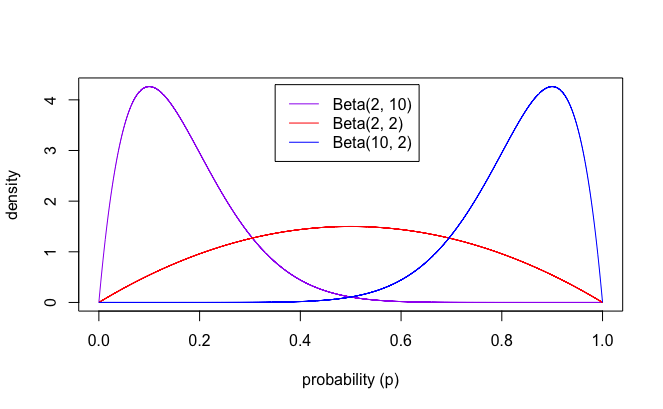
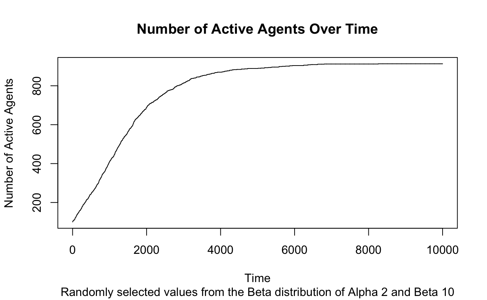
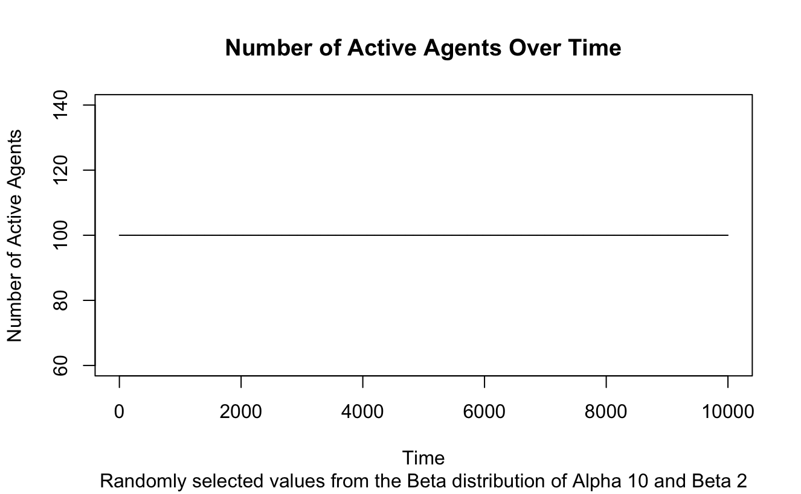
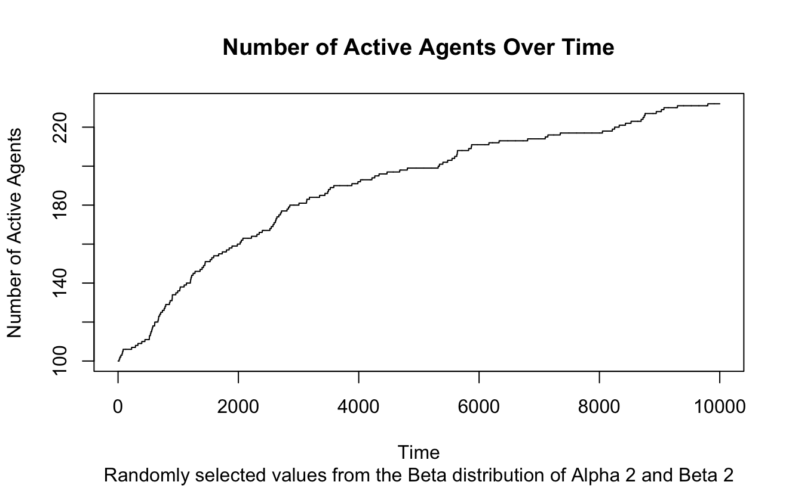

```{r setup, include=FALSE}
knitr::opts_chunk$set(echo = TRUE)
```

# Challenge 1 - Network Analysis

Your task is to create your own social network and then visualize and evaluate it along several metrics. To do this, you need to follow these steps:

**1.** Write down a list of people you know personally, as quickly as you can, between 15 and 20 people. These represent the nodes in your network.

**2.** Next, produce a weighted adjacency matrix indicating how well these people know one another (on a scale from 0 to 4) — this is data you can input based on your personal knowledge of the people and their relationships. You can use any software you like for this, but an excel sheet is straightforward. Make sure you attach these data with your submission so that the marker can reproduce your analysis.

**3.** For every possible threshold between 0 and 4, visualize the unweighted and undirected network, and so that node labels are clear and legible. You may need to try different layouts and you may need to relabel your nodes (e.g., with initials).

**4.** Choose what you see as the most informative unweighted network above, and produce a table of centrality measures for each of the nodes: degree, betweenness, eigenvector centrality, closeness, and clustering coefficient. Briefly explain what each of these measures tells us about your social network.

**5.** Provide evidence that this network is or is not assortative by degree. Explain what your result means.

**6.** For all the thresholds you used for keeping edges in your network, show which of these thresholds produces a network that is least like an Erdös-Renyi random graph in terms of clustering coefficient. To do this, generate 200 Erdös-Renyi random graphs of the same size and density as your network for each threshold and compare the distribution of clustering coefficients with the observed value for your social network at that threshold. You can use a one-sample t-test for each comparison. Report the analysis and visualize the winning thresholded network alongside an example ER random graph. ER random graphs are explained in detail in chapter 3 of your textbook.

**Note:** If you are interested in learning more about how people report their social networks, see Hills, T. T., & Pachur, T. (2012). Dynamic search and working memory in social recall. Journal of Experimental Psychology: Learning, Memory, and Cognition, 38(1), 218.

\newpage

```{r library, message=FALSE}
library(igraph)
library(scales)
library(tidyverse)
```

## Question 1

*Write down a list of people you know personally, as quickly as you can, between 15 and 20 people. These represent the nodes in your network.*

|         |           |         |
|---------|-----------|---------|
| Presha  | Rebecca   | Louise  |
| Heidi   | Luthfi    | Holly   |
| Aleks   | Catherine | Lani    |
| Aarushi | Sachika   | Kathryn |
| Melanie | Stella    | Zoe     |

## Question 2

*Next, produce a weighted adjacency matrix indicating how well these people know one another (on a scale from 0 to 4) — this is data you can input based on your personal knowledge of the people and their relationships. You can use any software you like for this, but an excel sheet is straightforward. Make sure you attach these data with your submission so that the marker can reproduce your analysis.*

```{r matrix}

friends <- read.csv(
  "5637058_Network.csv",
  header = T, # treat first row of the CSV file as the column names
  row.names = 1 # treat first column of the CSV file as row names
)

colnames(friends)
rownames(friends)

friends
```

\newpage

## Question 3

*For every possible threshold between 0 and 4, visualize the unweighted and undirected network, and so that node labels are clear and legible. You may need to try different layouts and you may need to relabel your nodes (e.g., with initials).*

```{r network}
friend_network <- graph_from_biadjacency_matrix(friends, weighted = TRUE)
```

```{r plot}

library(colorspace)

par(mfrow = c(1, 1))

node_names <- V(friend_network)$name # access node names
unique_nodes <- node_names %>% unique() %>% length() # number of unique nodes

node_colors <- qualitative_hcl(n = unique_nodes, palette = "Pastel") # assign a different color to each unique node


plot(
  friend_network,
  vertex.color = node_colors,
  vertex.size = 10,
  layout = igraph::layout_with_fr # Fruchterman-Reingold layout distributes nodes evenly
)
```

```{r monopartite}
fn_bp <- bipartite_projection(
  friend_network,
  multiplicity = TRUE # produces weighted edges between people that represent the number of affiliations they share
)

friends_mn <- fn_bp[[1]]

tkplot(friends_mn) # interactive plot
```

```{r threshold_func}
thresh_graph <- function(g, thresh) {
  # remove edges with weight < thresh
  gt <- igraph::delete_edges(g, igraph::E(g)[igraph::E(g)$weight < thresh])
  
  # set remaining edges to 1
  igraph::E(gt)$weight <- 1
  
  # return graph
  return(gt)
}
```

```{r threshold_plot}
for (i in seq(0, 4, 0.5)){
  thresh_plot <- thresh_graph(friends_mn, i)
  plot(
    thresh_plot, 
    vertex.label = NA, # remove node labels 
    layout = igraph::layout_with_fr,
    main = paste("Threshold:", i)
  )
}
```

\newpage

## Question 4

*Choose what you see as the most informative unweighted network above, and produce a table of centrality measures for each of the nodes: degree, betweenness, eigenvector centrality, closeness, and clustering coefficient. Briefly explain what each of these measures tells us about your social network.*

```{r optimal_threshold}
opt = 2

optimal_nm <- thresh_graph(friends_mn, opt)

plot(optimal_nm, vertex.label = NA, layout = igraph::layout_with_fr, main = paste("Optimal threshold:", opt))
```

```{r degree}
degree(optimal_nm)

plot(
  optimal_nm,
  layout = igraph::layout_with_fr,
  vertex.size = degree(optimal_nm), # node size reflects node degree
  vertex.label.dist = 2.5 # distance label from node center
)
```

```{r betweenness}
betweenness(optimal_nm)

plot(
  optimal_nm,
  layout = igraph::layout_with_fr,
  vertex.size = betweenness(optimal_nm), # node size reflects node degree
  vertex.label.dist = 1 # distance label from node center
)
```

```{r eigenvector}
friends_eigen <- eigen_centrality(optimal_nm)$vector
friends_eigen

# Plot local eigenvector centrality
plot(
  optimal_nm,
  vertex.size = friends_eigen * 10,
  vertex.label.dist = 2.5
)
```

```{r closeness}
friends_close <- closeness(optimal_nm, normalized = TRUE)
friends_close

friends_close[is.na(friends_close)] <- 0  # replace NaN with 0

# Plot local closeness
plot(
  optimal_nm,
  vertex.size = friends_close * 10,
  vertex.label.dist = 2.5
)
```

```{r clusteringcoeff}
friends_cc <- transitivity(
  optimal_nm, 
  type = 'local' # proportion of node's neighbours that are connected to one another (i.e., clustering of individual networks)
)
friends_cc

friends_cc[is.na(friends_cc)] <- 0  # replace NaN with 0

# Plot local clustering coefficient
plot(
  optimal_nm,
  vertex.size = friends_cc * 10,
  vertex.label.dist = 2.5
)
```

### **Answer**

+--------------------------------+---------------------------------------------------------------------------------------------------------+-----------------------------------------------------------------------------------------------------------------------------------------------------------------------------------------------------------------------------------------------------------------------------------------------------------------------------------+
| Centrality Measure             | Definition                                                                                              | Relation to the optimal thresholded social network                                                                                                                                                                                                                                                                                |
+================================+=========================================================================================================+===================================================================================================================================================================================================================================================================================================================================+
| *Degree*                       | Number of edges each node has                                                                           | Presha, Heidi and Catherine were the nodes with the most number of edges with 11 edges. This degree suggests that these individuals had 11 connections to other nodes.                                                                                                                                                            |
|                                |                                                                                                         |                                                                                                                                                                                                                                                                                                                                   |
|                                |                                                                                                         | Rebecca, Luthfi and Zoe were the nodes with the least number of edges with no edges. This degree suggests that these individuals had no connections with other nodes.                                                                                                                                                             |
+--------------------------------+---------------------------------------------------------------------------------------------------------+-----------------------------------------------------------------------------------------------------------------------------------------------------------------------------------------------------------------------------------------------------------------------------------------------------------------------------------+
| *Betweeness*                   | Number of shortest paths in the network that passes through a node                                      | Presha, Heidi and Catherine were the nodes with the highest betweeness score of 4.79. This high betweeness score suggests that these individuals play an important role in connecting different subgroups within the larger social network.                                                                                       |
|                                |                                                                                                         |                                                                                                                                                                                                                                                                                                                                   |
|                                |                                                                                                         | Seven individuals were nodes with a betweeness score of zero. This low betweeness score suggests these individuals do not facilitate communication across the entire social network.                                                                                                                                              |
+--------------------------------+---------------------------------------------------------------------------------------------------------+-----------------------------------------------------------------------------------------------------------------------------------------------------------------------------------------------------------------------------------------------------------------------------------------------------------------------------------+
| *Eigenvector centrality*       | Measure of node prestige (importance) by looking at how well-connected it is to other prestigious nodes | Presha, Heidi and Catherine were the nodes with the highest Eigenvector centrality of one. However, Rebecca, Luthfi and Zoe were the nodes with the lowest Eigenvector centrality with $4.874 \times 10^{-19}$. The greater Eigenvector centrality suggests that these nodes had many connections to other important nodes.       |
+--------------------------------+---------------------------------------------------------------------------------------------------------+-----------------------------------------------------------------------------------------------------------------------------------------------------------------------------------------------------------------------------------------------------------------------------------------------------------------------------------+
| *Closeness*                    | The inverse average distance to all other nodes (i.e., how close one node is to other nodes)            | Presha, Heidi and Catherine were the nodes with the highest closeness score of one. This high closeness score suggests that these individuals are well-connected within the social network; the nodes in the network require fewer edges to reach all other nodes.                                                                |
|                                |                                                                                                         |                                                                                                                                                                                                                                                                                                                                   |
|                                |                                                                                                         | Rebecca, Luthfi and Zoe were the nodes with the most number of edges without a closeness score. This lack of closeness suggests that these individuals are less well-connected/more isolated within the social network.                                                                                                           |
+--------------------------------+---------------------------------------------------------------------------------------------------------+-----------------------------------------------------------------------------------------------------------------------------------------------------------------------------------------------------------------------------------------------------------------------------------------------------------------------------------+
| *Local clustering coefficient* | Proportion of a node's neighbours that are connected to one another                                     | Aarushi, Sachika, Holly and Kathryn were the nodes with the highest local clustering coefficient of one. This high clustering coefficient suggests the presences of communities in the social network where an individual's friends are also friends with each other (i.e., node's neighbors are well-connected with each other). |
|                                |                                                                                                         |                                                                                                                                                                                                                                                                                                                                   |
|                                |                                                                                                         | Rebecca, Luthfi and Zoe were the nodes with the lowest local clustering coefficient of zero. This lack of a clustering coefficient suggests that a node's neighbors are not strongly connected. These individuals have friends who do not interact with each other and therefore act as a connector between these subgroups.      |
+--------------------------------+---------------------------------------------------------------------------------------------------------+-----------------------------------------------------------------------------------------------------------------------------------------------------------------------------------------------------------------------------------------------------------------------------------------------------------------------------------+

\newpage

## Question 5

*Provide evidence that this network is or is not assortative by degree. Explain what your result means.*

```{r assortativity}
assortativity_degree(optimal_nm)

colour_pal <- colorRampPalette(c('yellow', 'purple'))(11) # create 15-colour colour palette (from 1 to 11)
degree_scaled <- rescale(degree(optimal_nm), to = c(1, 11)) # rescale degree to the range 1-11 (to match the colour palette)

igraph::V(optimal_nm)$color <- colour_pal[degree_scaled]

plot(optimal_nm, vertex.label.dist = 2.5)
```

#### **Answer**

The negative assortativity (-0.205) suggests that there is a negative correlation between the degrees of connected nodes. This negative correlation suggests that this network is not assortative by degree; high-degree nodes are likely connected to low-degree nodes and vice versa.

\newpage

## Question 6

*For all the thresholds you used for keeping edges in your network, show which of these thresholds produces a network that is least like an Erdös-Renyi random graph in terms of clustering coefficient. To do this, generate 200 Erdös-Renyi random graphs of the same size and density as your network for each threshold and compare the distribution of clustering coefficients with the observed value for your social network at that threshold. You can use a one-sample t-test for each comparison. Report the analysis and visualize the winning thresholded network alongside an example ER random graph. ER random graphs are explained in detail in chapter 3 of your textbook.*

### Part 1: Generate 200 Erdös-Renyi Random Graphs

*To do this, generate 200 Erdös-Renyi random graphs of the same size and density as your network for each threshold and compare the distribution of clustering coefficients with the observed value for your social network at that threshold.*

```{r errg_cc}
# Create a list (can work similarly to dictionary)
errg_coeff = list()


# Thresholding samples of Erdös-Renyi random graphs
for (threshold in seq(0, 4, 0.5)){
  
  # Vary thresholding of network
  friends_mn_thresh <- thresh_graph(friends_mn, threshold)
  
  # Identify features of network
  density <- edge_density(friends_mn_thresh) %>% round(3)
  nodes <- vcount(friends_mn_thresh)
  edges <- ecount(friends_mn_thresh)
  
  # Print features of each thresholded network
  cat(
    paste0(
      "Threshold ", threshold, '\n',
      "Density: ", density, '\n',
      "Nodes: ", nodes, '\n',
      "Edges: ", edges, '\n\n'
    )
  )
  
  cc <- numeric()
  
  # Generate 200 samples of Erdös-Renyi random graphs
  for (i in seq(1, 200)){
    
    # Generate single sample of Erdös-Renyi random graphs using features from thresholded network
    errg_sample <- sample_gnm(
      n = nodes, # number of nodes
      m = edges, # number of edges 
      directed = FALSE, # undirected graph
      loops = FALSE # no self loops
    )
    
    # Calculate clustering coefficient for each sample 
    errg_cc <- transitivity(errg_sample, type = 'local') %>% round(3)
    
    # Append coefficient for each sample within a threshold to the list
    cc <- append(cc, errg_cc)
      
  }
  
  key <- as.character(threshold) # key needs to be a character not numeric
  errg_coeff[[key]] <- cc
}

errg_coeff %>% str()
```

```{r errg_df}
# Convert dictionary to tibble
errg_coeffs_df <- tibble(
  Threshold = names(errg_coeff),
  errg_coeffs = errg_coeff
)

print(errg_coeffs_df)

# Unnest the list within the dataframe
errg_coeffs_df <- errg_coeffs_df %>% 
  unnest(errg_coeffs) # expands list-columns (i.e., columns with lists in their cells) into multiple rows

print(errg_coeffs_df)

# Check for NaN
errg_coeffs_df$errg_coeffs %>% is.nan() %>% sum()

# Replace NaN with 0 
errg_coeffs_df$errg_coeffs[is.nan(errg_coeffs_df$errg_coeffs) | is.na(errg_coeffs_df$errg_coeffs)] <- 0

# Recheck for NaN
errg_coeffs_df$errg_coeffs %>% is.nan() %>% sum()
```

```{r original_cc}
coeffs <- list()

# Threshold original friendship network
for (t in seq(0, 4, 0.5)){
  
  # Vary thresholding
  friends_thresh <- thresh_graph(friends_mn, t)
  
  # Calculate clustering coefficient
  cc <- transitivity(friends_thresh, type = 'local')
  
  # Add to list as key and value
  key <- as.character(t)
  coeffs[[key]] <- cc
}

# Convert list to tibble
coeffs_df <- tibble(
  Threshold = names(coeffs),
  coeffs = coeffs
)

print(coeffs_df)

# Unnest listed values 
coeffs_df <- coeffs_df %>% unnest(coeffs)

print(coeffs_df)

# Calculate mean cc for each threshold
mean_coeffs_df <- coeffs_df %>% 
  group_by(Threshold) %>% 
  summarise(cc_mean = mean(coeffs, na.rm = TRUE) %>% round(3))

print(mean_coeffs_df)
```

\newpage

### Part 2: t-test Comparison

*For all the thresholds you used for keeping edges in your network, show which of these thresholds produces a network that is **least like an Erdös-Renyi random graph in terms of clustering coefficient.***

*...compare the distribution of clustering coefficients with the observed value for your social network at that threshold. You can use a one-sample t-test for each comparison.*

```{r ttest}
# Conduct inferential t-test
for (i in seq(0, 4, 0.5)){
  x <- errg_coeffs_df %>% filter(Threshold == i)
  mu <- mean_coeffs_df %>% filter(Threshold == i)

  ttest <- t.test(x$errg_coeffs, mu = mu$cc_mean)
  
  cat("Threshold:", i, '\n')
  print(ttest)
  cat('\n\n')

}
```

```{r bfttest}
library(BayesFactor)

# Conduct Bayesian t-test
for (i in seq(0, 4, 0.5)){
  x <- errg_coeffs_df %>% filter(Threshold == i)
  mu <- mean_coeffs_df %>% filter(Threshold == i)

  ttest <- ttestBF(x$errg_coeffs, mu = mu$cc_mean)
  
  cat("Threshold:", i, '\n\n')
  print(ttest)
  cat('\n\n')

}
```

\newpage

### Part 3: Reporting Optimal Threshold

*Report the analysis and visualize the winning thresholded network alongside an example ER random graph. ER random graphs are explained in detail in chapter 3 of your textbook.*

Threshold 3 was the winner as its clustering coeffcient had the greatest difference from the original network's clustering coeffcient ($t = -135.13, p = 2.20 \times 10^{-16}, BF_{10} = 4.26 \times 10^{1941}$). The Bayes Factor informs that there is decisive evidence for this finding (Wetzels et al., 2011).

```{r opt_plot}
threshold = 3

# Vary thresholding of network
friends_mn_thresh <- thresh_graph(friends_mn, threshold)

# Plot winning thresholded network
plot(friends_mn_thresh, vertex.label = NA)
```

```{r errg_plot}
threshold = 3

# Vary thresholding of network
friends_mn_thresh <- thresh_graph(friends_mn, threshold)

# Identify features of network
density <- edge_density(friends_mn_thresh) %>% round(3)
nodes <- vcount(friends_mn_thresh)
edges <- ecount(friends_mn_thresh)

# Print features of each thresholded network
cat(
  paste0(
    "Threshold ", threshold, '\n',
    "Density: ", density, '\n',
    "Nodes: ", nodes, '\n',
    "Edges: ", edges, '\n\n'
  )
)

cc <- numeric()

# Generate single sample of Erdös-Renyi random graphs using features from thresholded network
errg <- sample_gnm(
  n = nodes, # number of nodes
  m = edges, # number of edges 
  directed = FALSE, # undirected graph
  loops = FALSE # no self loops
)

# Plot ER random graph with winning threshold
plot(errg, vertex.label = NA, vertex.color = "purple", main = paste("Threshold:", threshold))
```

**Note:** If you are interested in learning more about how people report their social networks, see Hills, T. T., & Pachur, T. (2012). Dynamic search and working memory in social recall. *Journal of Experimental Psychology: Learning, Memory, and Cognition*, 38(1), 218.

\newpage

# Challenge 2 - Agent Based Modeling

Your second task is to propose and test two extensions of Granovetter's threshold model. Your starting point is the simple implementation of the model, which is described below. In this implementation, agents are located in a square grid and each one is assigned some threshold value. On each iteration, a randomly picked agent inspects eight of its immediate neighbours to see if they are active (1) or passive (0). If the proportion of active agents is higher than the agent's threshold value, the agent becomes active too.

Your task is as follows:

**1.** Think about the type of social process that you would like to model with this framework. You can choose anything you like, using the model to simulate the rising number of people who choose to riot, get married, adopt some technology, or just express some attitude. While it is completely up to you what you choose, in your answer you should explain how the model captures the key dynamics of your chosen social process.

**2.** You need to extend the model in two ways.

**a.** First, you are asked to explore how the distribution of thresholds in the population may influence the model's behaviour. Using simulations, show how the model behaves as you change the initial setup of thresholds of individual agents.

**b.** Second, you should extend the core behaviour of your agents. The goal here is to make your simulation more realistic in how it reflects basic psychological and social processes of individual agents. You are free to change any aspect of the model, and you can draw inspiration from the activities that we will discuss in our seminars.

**3.** You need to showcase, through simulation, how the two extensions (above) of the model influence its behaviour. Crucially, you should discuss how your results help us understand the psychological dynamics of your chosen social process. You should complement your answer with visualization that summarize the behaviour of your model.

**Note:** We will be enhancing this model during our final seminar session, and you are welcome to use the improved version for this assignment. You can also create your own independent implementation of the Granovetter's model. None of this is required however, and it will not impact your grade.

## Granovetter Model

```{r Granovetter, echo=TRUE, tidy=TRUE}
library(reshape2)

# Setup the number of cycles in the simulation.
cycle <- seq(1:10000)

# Define the grid size
grid_size <- 32

# Populate your grid with threshold values drawn at random from a beta distribution with parameters shape1 and shape2.
thresholds <- matrix(rbeta(n = grid_size^2, shape1 = 5, shape2 = 5),
nrow = grid_size, ncol = grid_size)

# Create a matrix of agents being active or not.
activity <- matrix(0, nrow = grid_size, ncol = grid_size)

# Randomly allocate some agents to be active from the start. This can be useful to get the simulation going, and you could explore this in your assignment.
activity[sample(1:(grid_size^2), 100)] <- 1

# Function to get the sum of thresholds of immediate neighbours.
get_neighbour_sum <- function(x, y, grid) {
  neighbours <- c(grid[x-1, y], grid[x+1, y], grid[x, y-1], grid[x, y+1], 
  grid[x-1,y-1], grid[x+1,y+1],grid[x-1,y+1], grid[x+1,y-1])
  return(sum(neighbours, na.rm = TRUE))
}

# Simulation
r <- vector()
for (i in 1:length(cycle)) {
  agent_x <- sample(2:(grid_size-1), 1)
  agent_y <- sample(2:(grid_size-1), 1)
  
  neighbour_sum <- get_neighbour_sum(agent_x, agent_y, activity)
  
  # Change agent to active if his threshold is below the proportion of surrounding active agents.
  if (thresholds[agent_x, agent_y] < (neighbour_sum / 8)) {
    activity[agent_x, agent_y] <- 1
  }
  
  r[i] <- sum(activity)
  # Optional methods to inspect behaviour of the simulation.
  #Sys.sleep(0.05)
  #print(neighbour_sum)
}

# Plot the results
plot(r, type = "l", main = "Number of Active Agents Over Time", xlab = "Time", ylab = "Number of Active Agents")

```

\newpage

## Part 1

***1.** Think about the type of social process that you would like to model with this framework. You can choose anything you like, using the model to simulate the rising number of people who choose to riot, get married, adopt some technology, or just express some attitude. While it is completely up to you what you choose, in your answer you should explain how the model captures the key dynamics of your chosen social process.*

The modelled social process is FOMO (fear of missing out).

The extension of this model will explore how an arbitrary '*importance*' of agents influences other agents' likelihood to adopt a social media trend.

## Part 2: Extend the Model

***2.** You need to extend the model in two ways.*

### Part 2a: Influence of the Distribution of Thresholds

***a.** First, you are asked to explore how the distribution of thresholds in the population may influence the model's behaviour. Using simulations, show how the model behaves as you change the initial setup of thresholds of individual agents.*

```{r threshold-sim}
# Function to get the sum of thresholds of immediate neighbours.
get_neighbour_sum <- function(x, y, grid) {
  neighbours <- c(
    grid[x-1, y], grid[x+1, y],
    grid[x, y-1], grid[x, y+1],
    grid[x-1,y-1], grid[x+1,y+1],
    grid[x-1,y+1], grid[x+1,y-1]
  )
  return(sum(neighbours, na.rm = TRUE))
}


threshold_sim <- function(grid_size = 32, cycle = 10000, alpha1, beta2) {
  
  # Create a matrix of agents
  activity <- matrix(0, nrow = grid_size, ncol = grid_size)
  
  # Randomly allocate some agents to be active from the start
  activity[sample(1:(grid_size^2), 100)] <- 1
  
  # Store number of activated agents
  activated_agents <- vector()
  
  # Threshold distribution
  distribution <- matrix(rbeta(n = grid_size^2, shape1 = alpha1, shape2 = beta2),
                         nrow = grid_size, ncol = grid_size)
  
  ### Simulation ###
  for (i in seq(cycle)) {
    # Identify random agent
    agent_x <- sample(2:(grid_size-1), 1)
    agent_y <- sample(2:(grid_size-1), 1)
    
    # Calculate sum of thresholds of immediate neighbours
    neighbour_sum <- get_neighbour_sum(agent_x, agent_y, activity)
    
    # Activate agent if their threshold is below the proportion of surrounding active agents.
    if (distribution[agent_x, agent_y] < (neighbour_sum / 8)) {
      activity[agent_x, agent_y] <- 1
    }
    
    # Store number of activated agents for each cycle
    activated_agents[i] <- sum(activity)
  }
  
  # Plot the results
  plot(
    activated_agents, type = "l",
    main = "Number of Active Agents Over Time",
    sub = paste("Randomly selected values from the Beta distribution of Alpha", alpha1, "and Beta", beta2),
    xlab = "Time",
    ylab = "Number of Active Agents"
  )
}
```

```{r threshold-sim-beta}
# Set seed for reproducibility
set.seed(3)

threshold_sim(grid_size, cycle, alpha1 = 2, beta2 = 10)
threshold_sim(grid_size, cycle, alpha1 = 2, beta2 = 2)
threshold_sim(grid_size, cycle, alpha1 = 10, beta2 = 2)
```

### Part 2b: Extend the Core Behaviour of Agents

***b.** Second, you should extend the core behaviour of your agents. The goal here is to make your simulation more realistic in how it reflects basic psychological and social processes of individual agents. You are free to change any aspect of the model, and you can draw inspiration from the activities that we will discuss in our seminars.*

Refer to the `extended-sim.R` file.

```{r DNR-extension, eval=FALSE, echo=FALSE, message=FALSE}
### NOTE (for me): RUN THE R FILE DO NOT RUN IN THE CHUNK ###

library(tidyverse)
library(reshape2)
dev.new() # turn graphics device on

### FUNCTION TO GET SUM OF THRESHOLDS OF IMMEDIATE NEIGHBOURS ###
get_neighbour_sum <- function(x, y, grid) {
  
  ### Identifying active and inactive neighbours ###
  neighbours <- c(
    grid[x-1, y], grid[x+1, y], 
    grid[x, y-1], grid[x, y+1],
    grid[x-1, y-1], grid[x+1, y+1],
    grid[x-1, y+1], grid[x+1, y-1]
  )
  
  ### Adjust influence of agents ###
  # Normal activated agents
  lv_count <- sum(neighbours == 1) 
  lv_score <- lv_count * 1
  
  # High-value activate agents
  hv_count <- sum(neighbours == 2) 
  hv_score <- hv_count * 2
  
  ### Total activation score ###
  activation_score <- sum(lv_score, hv_score, na.rm = TRUE)
  
  return(activation_score)
}


### SIMULATION FUNCTION ###
agent_sim <- function(grid_size, cycle, hv_prop = 0.10, beta_dist_shape = 2) {
  activated_agents <- vector()
  dev.new()
  if (hv_prop == 0) {colour_palette <- c("black", "orange")} else if (hv_prop == 1) {colour_palette <- c("black", "green")} else {colour_palette <- c("black", "orange", "green")}
  
  ### INITIALISING ENVIRONMENT & AGENTS ###
  agent_matrix <- matrix(0, nrow = grid_size, ncol = grid_size) # creating environment 
  agent_pop <- agent_matrix %>% as.vector() %>% length() # population of agent matrix (i.e., grid_size^2)
  agent_prop <- 0.25 # proportion of agent population to be activated
  samp <- (agent_pop * agent_prop) %>% round() # number of agents sampled to be activated 
  loc <- sample(1:agent_pop, samp) # randomly sample individual agents within the population to be activated
  
  
  ### ACTIVATING AGENTS ###
  agent_matrix[loc] <- sample(1:2, samp, replace = TRUE, prob = c((1 - hv_prop), hv_prop)) # activate randomly sample individual agents (default is 10% high-value agents, 90% low-value agents)
  
  # Count the number of (in)active agents (0 = inactive, 1 = normal, 2 = high-value)
  hv_count <- sum(agent_matrix == 2) # high-value active
  lv_count <- sum(agent_matrix == 1) # no-value active
  ia_count <- sum(agent_matrix == 0) # inactive
  
  cat(hv_count, lv_count, ia_count)
  
  
  for (i in seq(cycle)) {
    
    # Identify location of a random agent (ignoring agents on the edge of the grid)
    agent_x <- sample(2:(grid_size-1), 1)
    agent_y <- sample(2:(grid_size-1), 1)
    
    # Original agent 
    original_agent <- agent_matrix[agent_x, agent_y] # check activation status (0, 1, 2)
    
    # Individual agent activation threshold (follows a beta distribution)
    thresholds <- matrix(rbeta(n = grid_size^2, shape1 = beta_dist_shape, shape2 = beta_dist_shape), nrow = grid_size, ncol = grid_size) 
    activation_threshold <- thresholds[agent_x, agent_y]
    
    # Calculate sum of thresholds of immediate neighbours
    activation_score <- get_neighbour_sum(agent_x, agent_y, agent_matrix) / 8
    
    
    ### Activate agent if the neighbour's mean activation score is greater than the agent's individual threshold ###
    # If a high-value agent gets activated
    if (original_agent == 2 & activation_score > activation_threshold) {
      status <- "HV influenced"
      agent_matrix[agent_x, agent_y] <- 2.5
      if (!"hotpink" %in% colour_palette) {colour_palette <- append(colour_palette, "hotpink", after = which(colour_palette == "green"))} # introduce a new colour to the colour palette to indicate whether an agent has been activated  
    } else if (original_agent == 2 & activation_score <= activation_threshold)  {status <- "HV not influenced"}
    
    # If a low-value agent gets activated
    if (original_agent == 1 & activation_score > activation_threshold) {
      status <- "LV influenced"
      agent_matrix[agent_x, agent_y] <- 1.5
      if (!"yellow" %in% colour_palette) {colour_palette <- append(colour_palette, "yellow", after = which(colour_palette == "orange"))} 
    } else if (original_agent == 1 & activation_score <= activation_threshold) {status <- "LV not influenced"}
    
    # If an inactive agent gets activated
    if (original_agent == 0 & activation_score > activation_threshold) {
      status <- "IA activated"
      agent_matrix[agent_x, agent_y] <- 0.5
      if (!"lightgrey" %in% colour_palette) {colour_palette <- append(colour_palette, "lightgrey", after = which(colour_palette == "black"))}
    } else if (original_agent == 0 & activation_score <= activation_threshold)  {status <- "IA not activated" } 
    
    activated_agents[i] <- sum(agent_matrix != 0)
    
    
    ### Creating simulation ###
    sim_img <- image(
      agent_matrix,
      axes = FALSE, # remove axes
      main = paste("Step:", i, "Activation:", status),
      col = colour_palette
    )
    mtext(
      paste0(
        hv_prop * 100, "% of high-value agents within the agent population", "\n",
        "Inactive agent (black n = ", ia_count, ") is activated (lightgrey n = ", sum(agent_matrix == 0.5), ").", "\n",
        "Low-value active agent (orange n = ", lv_count, ") is influenced (yellow n = ", sum(agent_matrix == 1.5), ").", "\n",
        "High-value active agent (green n = ", hv_count, ") is influenced (hotpink n = ", sum(agent_matrix == 2.5), ").", "\n"
      ), 
      side = 1, # side location (i.e., bottom)
      line = 4, # location within the side 
      cex = 0.9 # font size
      )
    
    if (i == cycle) {
      png(paste0("plot_", hv_prop, "_sim.png"), width = 2000, height = 1600, res = 300)
      sim_img
      dev.off()
    } else {sim_img}
    
    Sys.sleep(0.005)
    
  }
  
  ### Plot ###
  png(paste0("plot_", hv_prop, ".png"), width = 2000, height = 1600, res = 300)
  par(mgp = c(2, 0.7, 0))
  plot(
    activated_agents, type = "l",
    main = "Number of Active Agents Over Time",
    xlab = paste0("Time (", cycle, " cycles)"),
    ylab = paste0("Number of Active Agents (total n = ", grid_size^2, ")"),
    cex.main = 1, cex.lab = 0.8, cex.axis = 0.7 # change font size
  )
  mtext(
    text = paste0("Proportion of high-value agents = ", hv_prop * 100, "%; Beta distribution shape parameters = ", beta_dist_shape, "\n",
                  "Highest number of activated agents = ", max(activated_agents)),
    side = 1, # location within the plot (e.g., bottom)
    line = 3.5, # position within the location
    cex = 0.6
  )
  dev.off()

}


set.seed(1)
for (hv in seq(0, 1, by = 0.25)) {agent_sim(grid_size = 36, cycle = 2000, hv_prop = hv)}


```

\newpage

## Part 3: How Simulations Explain Psychological Dynamics

***3.** You need to showcase, through simulation, how the two extensions (above) of the model influence its behaviour. Crucially, you should discuss how your results help us understand the psychological dynamics of your chosen social process. You should complement your answer with visualization that summarize the behaviour of your model.*

Capturing the phenomenon of FOMO (fear of missing out).

The extension will look to explore how the perceived 'importance' of agents influences other agents' likelihood to adopt a social media trend.

### Part 3a: Influence of the Distribution of Thresholds

The Beta distribution is the probabilities of probability for an event where the probability is not known. The unknown probability is treated as a random variable ($X$). The Beta distribution is then assigned to this random variable.

The Beta distribution has two parameters:

-   $\alpha$ is the number of successes or the prior belief about success.

    -   Higher $\alpha$ gives more weight to larger values (closer to 1).

    -   Lower $\alpha$ gives more weight to smaller values (closer to 0).

-   $\beta$ is the number of failures or the prior belief about failure.

    -   Higher $\beta$ gives more weight to smaller values (closer to 0).

    -   Lower $\beta$ gives more weight to larger values (closer to 1).

```{r beta-dist-threshold-sim}
### BETA DISTRIBUTIONS ###
# Define range of probabilities
p = seq(0, 1, length = 10000)

# Plot multiple Beta distributions
plot(p, dbeta(p, 2, 10), 
     ylab='density', xlab = 'probability (p)', 
     type ='l', col='purple')
lines(p, dbeta(p, 1, 1), col='red') 
lines(p, dbeta(p, 10, 2), col='blue')


# Add legend
legend(
  x = 0.35, y = 4.3, # position
  legend = c('Beta(2, 10)','Beta(2, 2)','Beta(10, 2)'), # names
  lty = c(1, 1, 1), # line type
  col = c('purple', 'red', 'blue')
)


### VARYING THRESHOLDS ###
set.seed(3)
threshold_sim(grid_size, cycle, alpha1 = 2, beta2 = 10)
threshold_sim(grid_size, cycle, alpha1 = 10, beta2 = 2)
threshold_sim(grid_size, cycle, alpha1 = 2, beta2 = 2)
```

#### **Answer**

Varying the shapes of a beta distribution can lead to different representations of FOMO (Figure 1). For example, if the distribution has a low alpha value and a high beta value, there is a greater likelihood of choosing lower probabilities. This right-skewed distribution indicates a higher density (i.e., where most values fall) among low probabilities (purple distribution in Figure 1). In the context of FOMO, the probabilities represent an individual’s agent activation threshold. Higher probabilities represent a higher activation threshold. This distribution could represent early hesitation in agents to engage with a confident attitude as others around them have not shown an interest in adopting this attitude. This interpretation aligns with the model presented in Figure 2, where over 4000 cycles were required for the number of activated agents (i.e., those adopting a specific attitude) to plateau. This model finding also aligns with Przybylski et al. (2013), whose research characterises FOMO as a need to be constantly aware of the attitudes and behaviours of those within an individual’s social circle. Thus, the model suggests that agents with thresholds drawn from a Beta distribution with a low alpha and high beta exhibited FOMO-like behaviour, initially hesitating but later adopting the attitude as more agents were activated.





Alternatively, higher probabilities are chosen if the distribution has a high alpha value and a low beta value. This left-skewed distribution indicates a higher density among high probabilities (blue distribution in Figure 1). This distribution may suggest a potential effect where some agents are urged to adopt an attitude as quickly as possible (e.g., a viral trend). This interpretation aligns with the model presented in Figure 3, in which a specific group of agents adopts the attitude early, but no further adoption occurs. This lack of an adoption curve (as previously seen in Figure 2) and preference for a specific group can be viewed as a potential ‘bandwagon' effect (i.e., having attitudes and behaviours influenced by conformity to group norms; Bearden & Rose, 1990) which is more common within-group conformity (e.g., Kang & Ma, 2020). Thus, using this model, it can be inferred that agents with thresholds following a Beta distribution with a high alpha value and a low beta value were not experiencing FOMO. Instead, agents were exhibiting signs of the bandwagon effect, adopting attitudes quickly due to group conformity rather than hesitation.



Finally, if the distribution has the same alpha and beta value, more middle probabilities are chosen. This bell-curve distribution shows a moderate increase in density at lower probabilities, a peak at the middle probabilities, and a gradual decrease in density at higher probabilities (red distribution in Figure 1). This distribution may suggest a natural social influence process, where agents adopt an attitude after seeing it gain popularity but before it is adopted by most of the agent population. This interpretation aligns with the model presented in Figure 4, where only a minority of agents are activated (less than 240 out of 1024 total agents) in 10,000 cycles. Thus, this model suggests that agents with thresholds following a Beta distribution with equal alpha and beta values were not experiencing FOMO but instead were influenced by ordinary social dynamics.



\newpage

### Part 3b: Extend the Core Behaviour of Agents

As the proportion of high-value activated agents within the agent population increases, the number of total activated agents also increases. This trend can be viewed in Table 1 below. This finding aligns with literature highlighting the significant impact people classified as “high-value” can have on shifting attitudes. For example, Osman et al. (2018) found that people were more likely to engage in behavioural interventions when developed and proposed by scientists rather than government officials. In relation to the current model, more agents are likely to adopt a specific attitude if their environment is more likely to consist of high-value agents.

| Percentage of high-value agents within the activated agent population (%) | Highest number of activated agents |
|----|----|
| 0 | 500 |
| 25 | 564 |
| 50 | 593 |
| 75 | 642 |
| 100 | 689 |

: *Table 1. Highest number of activated agents for each simulation differing in the proportion of high-value agents within the activated agent population*

However, the current simulation does not specify the type of high value. Traditionally, high-value individuals referred to their wealth and high-class status (i.e., within the workplace or a community). However, in the current digital age, high-value individuals can also include someone’s online social influence (e.g., number of followers). While the current model is an important starting point to explore the general influence of an arbitrarily high-value individual, future models could look to improve upon this by focusing on specific value types.

Moreover, the individual agent threshold can be varied. While keeping the distribution uniform (i.e., alpha and beta parameters are equal), increasing the Beta distribution also increases individual agent thresholds, as mid-range probabilities (e.g., 0.4–0.6) become more likely (Figure 5). This increased baseline agent threshold will mean that agents are likely to have greater individual thresholds thus may require more neighbouring active agents for activation.

```{r beta-dist}
p = seq(0, 1, length = 10000)


plot(p, dbeta(p, 10, 10), 
     ylab='density', xlab = 'probability (p)', 
     sub = "Figure 5. Uniform beta distributions with varying shape parameters", cex.sub = 0.8,
     type ='l', col='purple')
lines(p, dbeta(p, 5, 5), col='orange') 
lines(p, dbeta(p, 2, 2), col='darkgreen') 
abline(v = 0.4, col='red', lwd = 1.5, lty = 2)
abline(v = 0.6, col='red', lwd = 1.5, lty = 2)

legend(
  x = 0.70, y = 3.5, # position
  legend = c('Beta(10, 10)', 'Beta(5, 5)', 'Beta(2, 2)'), # names
  lty = c(1, 1, 1), # line type
  col = c('purple', 'orange' , 'darkgreen')
)
```

\newpage

# References

Bearden, W. O., & Rose, R. L. (1990). Attention to Social Comparison Information: An Individual Difference Factor Affecting Consumer Conformity. *Journal of Consumer Research*, *16*(4), 461. <https://doi.org/10.1086/209231>

Kang, I., & Ma, I. (2020). A Study on Bandwagon Consumption Behavior Based on Fear of Missing Out and Product Characteristics. *Sustainability*, *12*(6), 2441. <https://doi.org/10.3390/su12062441>

Osman, M., Fenton, N., Pilditch, T., Lagnado, D., & Neil, M. (2018). Whom Do We Trust on Social Policy Interventions? *Basic and Applied Social Psychology*, *40*(5), 249–268. <https://doi.org/10.1080/01973533.2018.1469986>

Przybylski, A. K., Murayama, K., DeHaan, C. R., & Gladwell, V. (2013). Motivational, emotional, and Behavioral Correlates of Fear of Missing out. *Computers in Human Behavior*, *29*(4), 1841–1848. <https://doi.org/10.1016/j.chb.2013.02.014>

Wetzels, R., Matzke, D., Lee, M. D., Rouder, J. N., Iverson, G. J., & Wagenmakers, E.-J. (2011). Statistical Evidence in Experimental Psychology. *Perspectives on Psychological Science*, *6*(3), 291–298. <https://doi.org/10.1177/1745691611406923>
